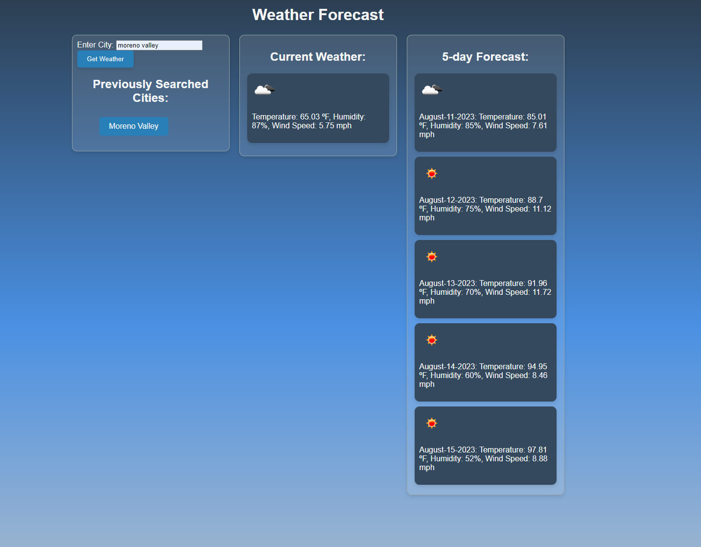

# Module 6 Challenge: Weather Dashboard

## Description

- This weather forecast app lets users obtain current weather data as well as a 5-day forecast.
- The weather data is sourced from OpenWeatherMap's API.
- Building this application enhanced my understanding of RESTful APIs and the intricacies of CSS.

## Installation

No installation is needed. Just visit the [live site](https://joseperez013.github.io/weather-dashboard/). 

## Usage

Upon loading the page, you'll be greeted by the main interface of the weather forecast application.

To fetch weather data, simply type in your desired city in the designated search bar.

Once a city is searched, the application displays the current weather information and a 5-day forecast.

Did you refresh the page by accident? No worries! Every searched city is saved to local storage, ensuring you don't lose your data. For a quick forecast lookup, just click on one of the previously searched cities.

## Credits

The weather data is generously provided by [OpenWeatherMap](https://openweathermap.org/).

## License

MIT License

Copyright (c) 2023 JosePerez013

Permission is hereby granted, free of charge, to any person obtaining a copy
of this software and associated documentation files (the "Software"), to deal
in the Software without restriction, including without limitation the rights
to use, copy, modify, merge, publish, distribute, sublicense, and/or sell
copies of the Software, and to permit persons to whom the Software is
furnished to do so, subject to the following conditions:

The above copyright notice and this permission notice shall be included in all
copies or substantial portions of the Software.

THE SOFTWARE IS PROVIDED "AS IS", WITHOUT WARRANTY OF ANY KIND, EXPRESS OR
IMPLIED, INCLUDING BUT NOT LIMITED TO THE WARRANTIES OF MERCHANTABILITY,
FITNESS FOR A PARTICULAR PURPOSE AND NONINFRINGEMENT. IN NO EVENT SHALL THE
AUTHORS OR COPYRIGHT HOLDERS BE LIABLE FOR ANY CLAIM, DAMAGES OR OTHER
LIABILITY, WHETHER IN AN ACTION OF CONTRACT, TORT OR OTHERWISE, ARISING FROM,
OUT OF OR IN CONNECTION WITH THE SOFTWARE OR THE USE OR OTHER DEALINGS IN THE
SOFTWARE.